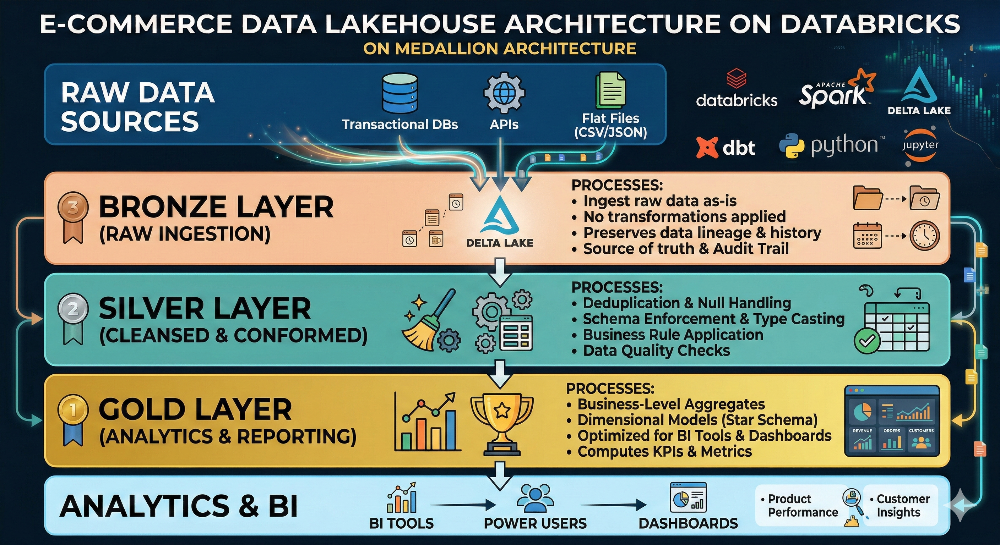

# 🛒 E-Commerce Data Lakehouse

A scalable, production-ready data lakehouse built on **Databricks** for an e-commerce company, following the **Medallion Architecture** (Bronze → Silver → Gold) to transform raw transactional data into analytics-ready insights.

---

## 📐 Architecture Overview


```
┌─────────────────────────────────────────────────────────┐
│                   Raw Data Sources                      │
│         (Transactional DBs, CSV files, APIs)            │
└───────────────────────┬─────────────────────────────────┘
                        │
                        ▼
┌─────────────────────────────────────────────────────────┐
│  🥉 BRONZE LAYER  (Raw Ingestion)                       │
│  • Ingests raw data as-is                               │
│  • No transformations applied                           │
│  • Preserves data lineage & history                     │
└───────────────────────┬─────────────────────────────────┘
                        │
                        ▼
┌─────────────────────────────────────────────────────────┐
│  🥈 SILVER LAYER  (Cleansed & Conformed)                │
│  • Deduplication & null handling                        │
│  • Schema enforcement & type casting                    │
│  • Business rule application                            │
└───────────────────────┬─────────────────────────────────┘
                        │
                        ▼
┌─────────────────────────────────────────────────────────┐
│  🥇 GOLD LAYER  (Analytics & Reporting)                 │
│  • Business-level aggregates                            │
│  • Dimensional models (Star Schema)                     │
│  • Optimized for BI tools & dashboards                  │
└─────────────────────────────────────────────────────────┘
```

---

## 📁 Project Structure

```
E_Comm/
│
├── raw-data/                  # Source data files
│
├── Layers Creation.ipynb      # Sets up Bronze/Silver/Gold layer structure
├── Utilities.ipynb            # Shared helper functions and utilities
│
├── Bronze.ipynb               # Raw data ingestion pipeline
├── Silver.ipynb               # Data cleaning & transformation pipeline
├── Gold.ipynb                 # Aggregation & dimensional modeling pipeline
│
└── README.md                  # Project documentation
```

---

## 🔄 Layer Details

### 🥉 Bronze Layer (`Bronze.ipynb`)
The **raw ingestion** layer — data lands here exactly as it comes from source systems.

- Ingests data from transactional databases and flat files
- Stores data in its original format with minimal processing
- Adds metadata columns (ingestion timestamp, source system)
- Acts as the source of truth and audit trail

### 🥈 Silver Layer (`Silver.ipynb`)
The **cleansed and conformed** layer — data is standardized and ready for integration.

- Removes duplicates and handles null/missing values
- Enforces consistent data types and schemas
- Applies business rules and data quality checks
- Joins and integrates data from multiple Bronze sources

### 🥇 Gold Layer (`Gold.ipynb`)
The **analytics-ready** layer — optimized for business reporting and decision-making.

- Builds fact and dimension tables (star schema)
- Computes business KPIs and aggregated metrics
- Designed for consumption by BI tools and dashboards
- Examples: sales summaries, customer segments, product performance

---

## 🛠️ Tech Stack

| Tool | Purpose |
|---|---|
| **Databricks** | Unified analytics platform & compute |
| **Apache Spark** | Distributed data processing |
| **Delta Lake** | ACID-compliant storage layer |
| **dbt** | Data transformation & modeling |
| **Python 3.8+** | Scripting and orchestration |
| **Jupyter Notebooks** | Interactive development |

---

## 🚀 Getting Started

### Prerequisites

- A **Databricks** account with a running cluster
- **Python 3.8** or higher
- **dbt** installed and configured for Databricks

### Setup

1. **Clone the repository**
   ```bash
   git clone https://github.com/arun8nov/E_Comm.git
   cd E_Comm
   ```

2. **Upload to Databricks**
   - Import the notebooks into your Databricks workspace
   - Upload the `raw-data/` folder to DBFS or your configured storage path

3. **Run in order**
   ```
   1. Layers Creation.ipynb   ← Run first to set up layer structure
   2. Bronze.ipynb            ← Ingest raw data
   3. Silver.ipynb            ← Clean and transform
   4. Gold.ipynb              ← Build analytics models
   ```
   Use `Utilities.ipynb` as a reference — it contains shared functions used across notebooks.

---

## 📊 Key Metrics & Use Cases

The Gold layer enables analysis such as:

- 📦 **Order Analytics** — order volumes, fulfillment rates, return rates
- 👤 **Customer Insights** — segmentation, lifetime value, churn prediction
- 🛍️ **Product Performance** — top sellers, inventory trends, category analysis
- 💰 **Revenue Reporting** — daily/weekly/monthly revenue aggregates

---


## 📄 License

This project is open source. Feel free to use and adapt it for your own data engineering projects.